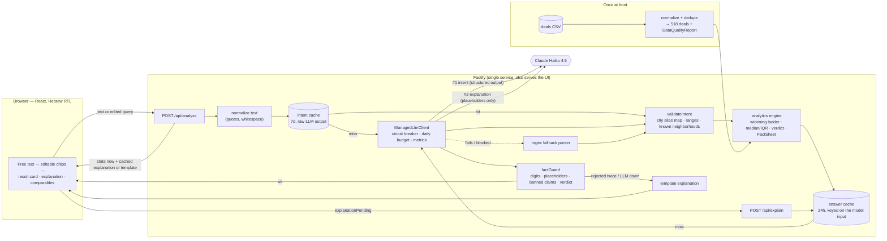

# בדיקת מחיר הוגן — Fair Price Check

A buyer pastes a free-Hebrew description of a home they're looking at —
_"דירת 4 חדרים בגבעתיים, 95 מ״ר, קומה 3 עם מעלית, מבקשים 3.9 מיליון"_ — and gets:
how the asking price compares to comparable recorded deals, how confident that
comparison is, and the exact deals it is based on. No asking price → the price range
for comparable homes. I chose this because it's the question a buyer actually has
in front of a listing, it needs language understanding only at the edges (messy Hebrew
in, readable Hebrew out), and everything in between can be deterministic, checkable
code — which is what makes "never state what the data doesn't support" enforceable
rather than hoped for.

**Live URL:** https://fair-price-check.onrender.com/

---

## Architecture



Monorepo: `packages/shared` (zod schemas, types, city map, Hebrew formatters — used
by both sides), `apps/api` (Fastify + all logic), `apps/web` (React + Vite + Tailwind).

## The LLM / code boundary

The LLM is used for exactly two things that need judgment over language. Everything
that produces a number or a claim is code.

| LLM                                                                                                                                                                                                                                                                | Code                                                                                                                                                                                                                                                                                                                                                                                                |
| ------------------------------------------------------------------------------------------------------------------------------------------------------------------------------------------------------------------------------------------------------------------ | --------------------------------------------------------------------------------------------------------------------------------------------------------------------------------------------------------------------------------------------------------------------------------------------------------------------------------------------------------------------------------------------------- |
| **#1 Intent:** messy Hebrew → structured query. Slang and abbreviations ("ת״א", "3 וחצי חד׳", "ממ״ד"), prices in words ("מיליון ו-200", "שני מיליון ושמונה מאות אלף"), typos ("גבעתים"), implied millions ("מבקשים 2.8"), and noticing a city we have no data for. | Normalization, city alias resolution, range checks, neighborhood matching against the data — **every LLM field is re-validated and dropped individually if invalid**.                                                                                                                                                                                                                               |
| **#2 Explanation:** a short Hebrew paragraph — **using placeholders only** (`{{median_ppsqm}}`). The model sees fact _ids and descriptions_, never values or raw deals.                                                                                            | Matching and widening, median / IQR / percentages, the verdict, confidence, formatting every number with `Intl` (`he-IL`), **rendering the placeholders**, and the fact guard that rejects digits, number words, unknown placeholders, banned claims (price trends, predictions, neighborhood quality, the street, legal/mortgage/investment advice, certainty) and text contradicting the verdict. |

Why this split: a model that never sees a number can't misstate one, and a guard that
runs in code is a guarantee, not a prompt instruction. The model can still choose a
_wrong-meaning_ placeholder ("{{estimate_low}} is the median") — the guard can't detect
that; the fact descriptions make it unlikely. That's the residual risk, stated rather
than hidden.

Every response says where its text came from (`source: llm | fallback`,
`explanationSource: llm | template`, with a reason), and the UI shows it
(`נוסח ע״י AI` / `נוסח אוטומטי`; every number in the explanation is highlighted and
shows its source fact on hover/tap).

## Data decisions

The CSV is normalized once at boot; the full report is at `GET /api/data-quality`
(also `npm run data:report -w @fpc/api`). Highlights:

| Issue in the file                                         | Decision                                                                                                                                                                                                         |
| --------------------------------------------------------- | ---------------------------------------------------------------------------------------------------------------------------------------------------------------------------------------------------------------- |
| 530 rows, duplicate `deal_id`s                            | 6 exact duplicates dropped; 4 conflicting ones resolved by source precedence `רשות המסים > מתווך > בעל נכס`, each logged at boot.                                                                                |
| Prices `0` and `18000`                                    | Rejected (< ₪300K). → **518 deals.**                                                                                                                                                                             |
| 38.5M / 44M-type extremes                                 | Flagged per city with a 3×IQR fence on price _or_ ₪/m² (5 deals), kept in the data, excluded from stats, listed in the UI. 1.5×IQR flagged 25 mostly-legitimate luxury deals.                                    |
| 29 city spellings (`ת"א`, `Tel Aviv-Yafo`, `"ירושלים "`…) | One alias map → 18 canonical cities, shared with the LLM validation and the UI. Unknown → `null`, never a guess (`מודיעין עילית` ≠ `מודיעין`).                                                                   |
| Neighborhood spellings                                    | Whitespace fixed (139 rows); 5 same-place variants merged (`רמב"ש א'` → `רמת בית שמש א'`, `Florentin` → `פלורנטין`). `מרכז` vs `מרכז העיר` deliberately **not** merged. Identity is always (city, neighborhood). |
| `price_per_sqm` column                                    | **Ignored and recomputed** — 10 missing, 2 zero, 28 more off by > 2% from price ÷ size.                                                                                                                          |
| 4 date formats, 56 ambiguous `dd/mm`                      | One explicit parser per format, day-first for dot/slash, `Mon YYYY` → month precision; dates after today rejected. Tested: `2026-02-12` → Feb 12.                                                                |
| Booleans in 8 spellings, 20 unknown `has_parking`         | Tri-state: unknown is not "no".                                                                                                                                                                                  |
| 85 `חדש מקבלן` rows built before 2015                     | Kept as-is, **not used for matching** — the field contradicts itself too often to filter on.                                                                                                                     |
| Same ~33 street names in every city                       | Street dropped from the model entirely, so it can't be matched on or quoted.                                                                                                                                     |

Matching: neighborhood + type + rooms ±0.5 → city + type + rooms ±0.5 → city + rooms ±1
→ city, stopping at ≥ 8 usable comparables. Median and IQR on ₪/m² when a size is
given (total price otherwise, capped at MEDIUM). The asking price is compared, never
used as a filter (tested: 1M / 3.9M / 40M give identical stats). Confidence is
HIGH / MEDIUM / LOW / INSUFFICIENT (< 5 → no estimate at all). On this 518-deal sample
**no query reaches HIGH** (largest type-level set is 13; HIGH needs 15) — kept honest
rather than lowering the bar.

## Failure modes

| What fails                        | What the user gets                                                                                                                                                                                             |
| --------------------------------- | -------------------------------------------------------------------------------------------------------------------------------------------------------------------------------------------------------------- |
| LLM slow                          | Intent times out at 2.5s → regex parser; explanation at 4s → template; whole request bounded at 7s. Stats never wait for the explanation (`/api/analyze` returns first).                                       |
| LLM wrong (intent)                | Each bad field dropped and listed ("לא השתמשנו ב: …"); the user sees and can edit every parsed chip.                                                                                                           |
| LLM wrong (explanation)           | Fact guard rejects → one retry with the violations fed back → template.                                                                                                                                        |
| LLM down / 5 consecutive failures | Circuit breaker opens for 30s; template mode with a subtle notice; full stats and comparables.                                                                                                                 |
| Daily LLM budget used up          | Same template mode — never an error.                                                                                                                                                                           |
| No `LLM_API_KEY`                  | The whole app runs in template mode (tested end to end); a neutral "running without AI" notice.                                                                                                                |
| Invalid / revoked key             | One failing call, then a 10-minute cooldown in template mode: an "AI unavailable" notice, an error-level log, and `mode: degraded` in `/api/health`.                                                           |
| Abuse                             | 20 req/min per IP (429), 500-char input, 8 KB body, capped `max_tokens`. See [COST.md](COST.md).                                                                                                               |
| No city / unknown city            | A Hebrew question, close-spelling suggestions (`גבעתים` → גבעתיים), full city list. No fake suggestion for a city that just isn't in the data (`אילת`).                                                        |
| Too few comparables               | `INSUFFICIENT`: no estimate, "אין מספיק עסקאות דומות כדי להעריך — הנה מה שיש", the deals that exist.                                                                                                           |
| Restart / deploy                  | SIGTERM drains in-flight requests (10s grace). Caches and metrics reset; the daily budget survives when `BUDGET_STATE_FILE` is on a disk. One instance by design — [COST.md](COST.md) → "At 10×" covers Redis. |
| Client disconnects                | In-flight LLM calls are cancelled (not paid for to completion) and don't count against the provider's health.                                                                                                  |
| Rendering bug in the results      | An error boundary contains it; the search form keeps working and the next search clears it.                                                                                                                    |

## What I cut, and why

- **Real streaming (SSE).** The two-request version (`/api/analyze` then
  `/api/explain`) gives the same "numbers first" experience with no streaming
  infrastructure.
- **Redis.** The `Cache` interface is async so it drops in; one instance doesn't need it.
- **Floor, elevator, parking, safe room in matching.** Parsed and shown, not used: 518
  deals can't be split further without destroying the comparable sets.
- **Time-adjusting old prices.** Any adjustment is a trend claim the data can't support;
  recency only breaks ties, and the date range is always shown.
- **Neighborhood list in the prompt.** ~1,000 extra tokens per call; code matches the
  model's raw text against the data instead.
- **LLM eval runs, measured cost tables and recorded LLM responses** — the scripts and
  the replay harness exist and refuse to invent numbers; they need an API key (see
  [COST.md](COST.md) and `apps/api/src/llm/recordings/`).


## How to run locally

Requires Node 22 LTS (`.nvmrc`; ≥ 22.12).

```bash
npm ci

# Development: two terminals
npm run dev -w @fpc/api      # API on http://localhost:3000
npm run dev -w @fpc/web      # UI on http://localhost:5173 (proxies /api to :3000)

# Production mode: one process serves API + built UI on http://localhost:3000
npm run build
npm start
```

Without `LLM_API_KEY` everything works in **template mode** (regex parser + code-written
explanation). To use Claude: `LLM_API_KEY=sk-ant-... npm start`.

| Env var                                            | Default                      | Purpose                                                |
| -------------------------------------------------- | ---------------------------- | ------------------------------------------------------ |
| `LLM_API_KEY`                                      | —                            | Anthropic API key. Unset → template mode.              |
| `LLM_MODEL`                                        | `claude-haiku-4-5`           | Model for both LLM calls.                              |
| `LLM_INTENT_TIMEOUT_MS` / `LLM_EXPLAIN_TIMEOUT_MS` | 2500 / 4000                  | Per-call timeouts.                                     |
| `LLM_DAILY_CALL_BUDGET`                            | 20000                        | Global LLM calls/day; past it → template mode.         |
| `RATE_LIMIT_PER_MINUTE`                            | 20                           | Per-IP limit on the POST routes.                       |
| `PORT`, `HOST`, `LOG_LEVEL`                        | 3000, 0.0.0.0, info          | Server.                                                |
| `TRUST_PROXY_HOPS`                                 | 0                            | Set 1 only behind exactly one proxy (Render does).     |
| `METRICS_TOKEN`                                    | — (metrics disabled)         | Bearer token for `/api/metrics` (≥ 16 chars).          |
| `BUDGET_STATE_FILE`                                | — (in memory)                | Persist the daily LLM call counter across restarts.    |
| `LLM_RECORD_DIR`                                   | —                            | Evals only: save raw LLM responses for contract tests. |
| `DATA_CSV_PATH`, `WEB_DIST_DIR`                    | bundled CSV, `apps/web/dist` | Paths, for unusual layouts.                            |

All thresholds (confidence, outliers, timeouts, TTLs, limits) live in
[`apps/api/src/config.ts`](apps/api/src/config.ts), each with the reason for its value.
Environment variables are validated at boot ([`env.ts`](apps/api/src/env.ts)): a bad value
stops the server with a clear message instead of silently falling back.

### Tests, evals, cost

```bash
npm run ci                                               # everything CI runs: types, lint, format, tests+coverage, build, e2e
npm test                                                 # unit + integration + component tests
npm run test:coverage
npm run e2e                                              # Playwright on the production build (phone + desktop), uses system Chrome
npm run lint && npm run format:check
npm run typecheck
npm run data:report -w @fpc/api                          # DataQualityReport
npm run eval:intent -w @fpc/api -- --mode=fallback       # 25-case intent eval, regex parser (free)
LLM_API_KEY=... npm run eval:intent  -w @fpc/api         # same eval with Claude
LLM_API_KEY=... npm run eval:explain -w @fpc/api         # explanation eval: guard pass rate + tokens
# add LLM_RECORD_DIR=apps/api/src/llm/recordings to either eval to record replay fixtures
npm run cost:report -w @fpc/api -- --write               # measured tables → COST.md
```

Intent eval ([`evals/intent.jsonl`](evals/intent.jsonl): slang, typos, missing city,
city not in the data, English city, prices in words, two injection attempts):
the regex fallback gets **20/25** exact; its 5 misses are exactly the language-judgment
cases (prices in words, a typo'd city, implied millions, naming an unknown city, a
neighborhood). LLM results: TODO(measure) — `evals/results/` holds every run.

